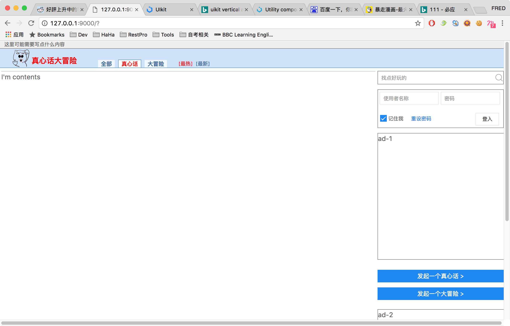
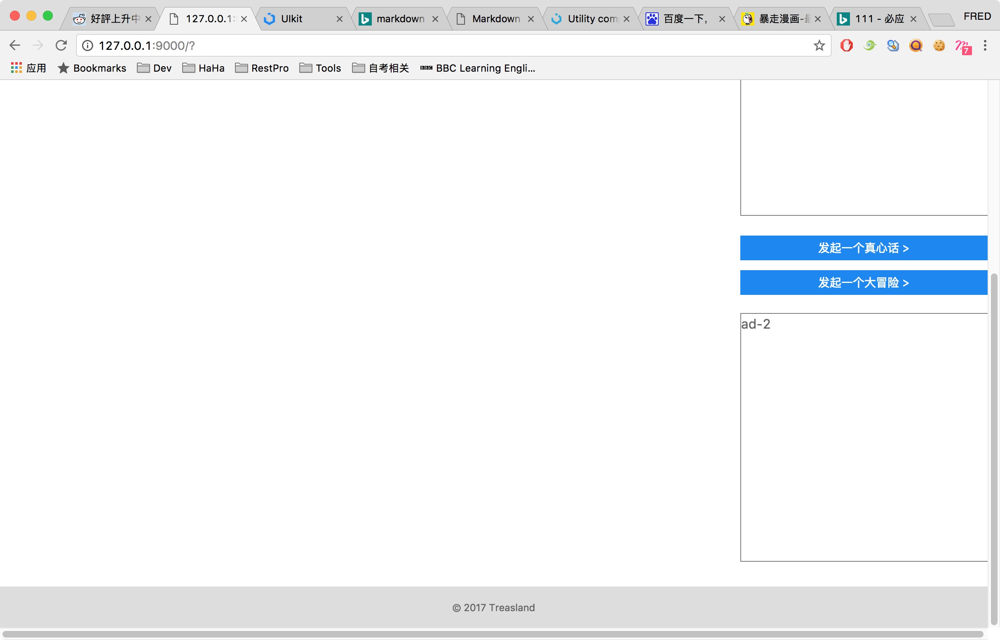

#### Project Development Diary, Code: JellyFish

1. 2017-07-10

   开始 JellyFish 项目，环境搭建。

   建立基本的项目目录

   安装：MySQL, Python 3.6.1, aiohttp, aiomysql, jinja2, VSCode

   ​

2. 2017-07-11

   今天把底层框架的代码从教程项目中复制到了工程里，接下来要改一下底层框架，去掉原有的一些东西，加入本项目的东西。布局方面除了Reddit，又看了一下V2EX，有的地方可以参考一下。

   ​

3. 2017-07-16

   前几天把网站的布局设计了一下，今天把网站框架基本弄好，首先定好了数据结构，建立了Sql脚本文件。创建了对应的数据库和表。在运行的时候，因为我把代码放在了src目录下，所以跟之前的结构不一样，相应到static和template的路径也要改。以前的示例代码还没有删除，但是改变了指向主页的模板，接下来可以参考以前的示例来写一下页面了。还有关于评论那一块的查询要看一下怎么弄，牵扯到嵌套评论。不知道先从数据库中读出来，然后在内存中去组织是否可行。

   ​

4. 2017-07-20

   今天弄好了uikit引用问题，不知道为什么我自己建立的工程就是引用不到静态资源，现在直接在教程工程上改了一下代码，可以用了，但是我还不知道为什么，先这样用着吧，接下来开始写页面

   ​

5. 2017-07-22

   今天一下午都在做主页相关的事情，写好了导航条，右侧边栏和Footer，只是基本上HTML上的工作，还没有写具体的处理逻辑，接下来看看，可能先写点登录相关的逻辑，或者还是继续写HTML。明天可能就不搞网站相关的东西了，要学习点新知识，还有工作上的游戏项目有一些功能需要写一下。截张图记录一下吧。

   

